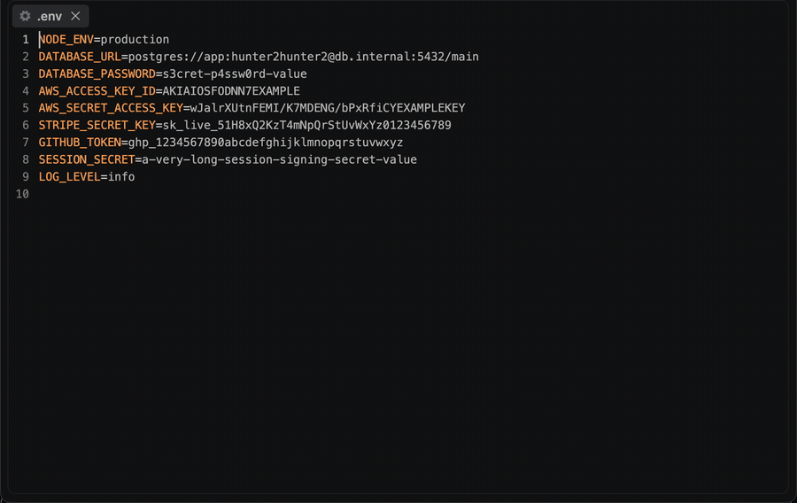

<p align="center">
  
</p>
<h1 align="center">Secrets-LE: Zero Hassle Secret Detection</h1>
<p align="center">
  <b>Find hardcoded credentials across your workspace, then redact them in place</b><br/>
  <i>API keys, tokens, passwords, private keys — 100% local, nothing leaves your machine</i>
</p>

<p align="center">
  <a href="https://marketplace.visualstudio.com/items?itemName=nolindnaidoo.secrets-le">
    
  </a>
  <a href="https://open-vsx.org/extension/OffensiveEdge/secrets-le">
    
  </a>
  <a href="https://www.npmjs.com/package/secrets-le-mcp">
    
  </a>
  <a href="https://crates.io/crates/secrets-le">
    
  </a>
  <a href="https://letools.dev/tools/secrets-le">
    
  </a>
</p>

---

<p align="center">
  
</p>

> **Useful?** A star or rating is how other developers find it —
> [★ GitHub](https://github.com/nolindnaidoo/secrets-le) ·
> [★ Open VSX](https://open-vsx.org/extension/OffensiveEdge/secrets-le/reviews) ·
> [★ Marketplace](https://marketplace.visualstudio.com/items?itemName=nolindnaidoo.secrets-le&ssr=false#review-details)

## What it does

Open a workspace, press `Ctrl+Alt+S` (`Cmd+Alt+S` on Mac), and every detected secret lands in a results document — grouped by file, with line/column positions pointing at the value itself. Run `Secrets-LE: Sanitize Secrets` to replace the secrets in the active file with a placeholder. Works in VS Code and in VS Code–based editors like Cursor and VSCodium (installable from Open VSX).

Detection is regex-based over the full text of each file, so it works on any text format — code, configs, `.env` files, YAML, JSON, logs. It is a pre-commit safety net, not a guarantee: a scanner built on patterns can miss secrets and can flag non-secrets. Review the results.

## Use it from an AI agent

The same engine runs as an [MCP](https://modelcontextprotocol.io) server, so an agent can call it directly instead of you running a command.

| Editor | How |
|---|---|
| **VS Code** 1.101+ | Nothing to install — the extension registers `detect_secrets` with agent mode |
| **Zed** | No listing yet — [add the MCP server by hand](https://zed.dev/docs/ai/mcp) |
| **Claude Code** | `claude mcp add secrets-le -- npx -y secrets-le-mcp` |
| **Cursor, Windsurf, anything else** | point it at `npx secrets-le-mcp` |

```
detect_secrets(content, sensitivity?, includeApiKeys?, includePasswords?, includeTokens?, includePrivateKeys?, maxResults?)
```

Reports each finding by type, confidence, key name and 1-based position. **Values are never returned** — previews are truncated and length-annotated, and the context line has the secret masked out, so a finding can be located without the credential leaving the machine it was found on.

The server takes content and returns data — it reads no files and makes no network requests of its own. Published as [`secrets-le-mcp`](https://www.npmjs.com/package/secrets-le-mcp) on npm and as `io.github.nolindnaidoo/secrets-le` in the [MCP registry](https://registry.modelcontextprotocol.io).

<details>
<summary><b>Configuring it by hand</b> — any host with an MCP config file</summary>

Most hosts read a JSON config. Add one entry:

```json
{
  "mcpServers": {
    "secrets-le": {
      "command": "npx",
      "args": ["-y", "secrets-le-mcp"]
    }
  }
}
```

`-y` skips the install prompt on first run. Pin a version if you would rather not track releases — `secrets-le-mcp@2.2.1`.

Prefer not to go through `npx` on every launch? Install it once and point at the binary instead:

```bash
npm install -g secrets-le-mcp
```

```json
{
  "mcpServers": {
    "secrets-le": { "command": "secrets-le-mcp" }
  }
}
```

It speaks MCP over stdio and needs no environment variables, no API key and no configuration of its own. To check it before wiring it into anything:

```bash
echo '{"jsonrpc":"2.0","id":1,"method":"tools/list"}' | npx -y secrets-le-mcp
```

That prints the tool list and exits — if you see `detect_secrets`, the server works.

</details>

## The CLI

The same detection runs from a terminal or a CI step: a Rust CLI in
[`crate/`](crate/README.md), sharing one pattern table with the extension
— [`crate/signatures/patterns.toml`](crate/signatures/patterns.toml) —
so the two can never disagree about what counts as a credential.

```bash
secrets-le .                        # scan a tree
secrets-le --sensitivity high .     # only high-confidence findings
secrets-le --no-ignore --hidden .   # reach .env and everything git ignores
secrets-le mcp                      # the same detection over MCP on stdio
```

The exit code is the answer: **0 nothing found · 1 findings · 2 the
question was malformed** — so `secrets-le .` is a CI step as it stands.

**It never prints a credential.** A scanner's output goes into a CI log,
which is archived, often world-readable, and outlives the secret; a
scanner that printed what it found would disclose it more widely than
the commit would have. Previews are capped at eight characters *and* at
half the value's length, context lines are masked, and there is no flag
that changes either. The extension is the half that can *fix* what it
finds; the binary only reports.

Install it with `cargo install secrets-le`
([crates.io](https://crates.io/crates/secrets-le)). The spec
([`crate/SPEC.md`](crate/SPEC.md)) and the engineering standard
([`crate/AGENTS.md`](crate/AGENTS.md)) live alongside it, and it keeps
its own [CHANGELOG](crate/CHANGELOG.md).

**Two MCP servers, one tool.** `secrets-le mcp` offers `detect_secrets`
exactly as [`secrets-le-mcp`](https://www.npmjs.com/package/secrets-le-mcp)
does — [`crate/fixtures/mcp-detect-secrets.json`](crate/fixtures/mcp-detect-secrets.json)
runs against both and CI fails if they diverge. Take the npm one if Node
is already there; take the binary if you want no runtime, or if you want
`secrets_le_scan` too.

## What gets detected

| Category | Types |
|---|---|
| API keys & cloud credentials | Generic API keys (`api_key = …`), AWS Access Key IDs (`AKIA…`, no key name needed), AWS Secret Access Keys, Azure account keys, GCP/Google Cloud keys |
| Tokens | Generic tokens, bearer tokens, access/refresh tokens, OAuth tokens, JWTs (key-based or bare `eyJ…` form), known prefixes: GitHub `ghp_`/`github_pat_`, Slack `xox?-`, Stripe `sk_live_`/`sk_test_`, Google `AIza…` |
| Passwords | `password`/`passwd`/`pwd` values, including compound keys (`DATABASE_PASSWORD`) |
| Private keys | Multi-line PEM blocks — RSA/EC, OpenSSH, PGP |
| Connection data | Database URLs with embedded `user:pass@` credentials, connection strings, session IDs, cookies |

Key-based patterns accept quoted and unquoted keys, so JSON (`"apiKey": "…"`), YAML (`api_key: …`), env (`API_KEY=…`), and code (`apiKey = '…'`) all match.

**Intentional non-detections**: template placeholders (`${VAR}`, `{{var}}`, `<your-key>`, `xxxxxxxx`), version numbers and hostnames that merely look dotted (`1.2.3` is not a JWT), GCP project ids (identifiers, not credentials), and database URLs without embedded credentials.

**Known limitations**: detection is pattern-based — obfuscated, split, or unconventionally named secrets are missed; JWTs whose header isn't standard base64 JSON (`eyJ…`) are missed; a high-entropy string without a recognizable key name or prefix is not reported.

## Commands

| Command | Description |
|---|---|
| `Secrets-LE: Detect Secrets` (`Ctrl+Alt+S` / `Cmd+Alt+S`) | Scan the workspace and open a results document |
| `Secrets-LE: Sanitize Secrets` | Replace detected secrets in the active file (asks for confirmation first) |
| `Secrets-LE: Open Settings` | Open Secrets-LE settings |
| `Secrets-LE: Help` | Built-in documentation |

## Settings

| Setting | Default | Description |
|---|---|---|
| `secrets-le.detection.sensitivity` | `medium` | `low` reports everything, `medium` drops low-confidence matches, `high` keeps only high-confidence ones |
| `secrets-le.detection.includeApiKeys` | `true` | Detect API keys and cloud credentials |
| `secrets-le.detection.includePasswords` | `true` | Detect passwords |
| `secrets-le.detection.includeTokens` | `true` | Detect tokens and JWTs |
| `secrets-le.detection.includePrivateKeys` | `true` | Detect PEM private-key blocks |
| `secrets-le.sanitization.replaceWith` | `***REDACTED***` | Replacement text used by Sanitize |
| `secrets-le.workspace.scanPatterns` | `["**/*"]` | Glob patterns to scan |
| `secrets-le.workspace.scanExcludes` | node_modules, .git, dist, … | Glob patterns to skip |
| `secrets-le.workspace.scanMaxFiles` | `10000` | Cap on files scanned per run |
| `secrets-le.safety.enabled` | `true` | Guardrails for very large files |
| `secrets-le.safety.fileSizeWarnBytes` | `1000000` | Skip/refuse files above this size |
| `secrets-le.dedupeEnabled` | `false` | Collapse identical value+type detections in results |
| `secrets-le.copyToClipboardEnabled` | `false` | Also copy results to the clipboard |
| `secrets-le.openResultsSideBySide` | `true` | Open results beside the current editor |
| `secrets-le.notificationsLevel` | `important` | `all` = every notification, `important` = warnings + errors, `silent` = errors only |
| `secrets-le.statusBar.enabled` | `true` | Show the status bar item |
| `secrets-le.telemetryEnabled` | `false` | Local-only event log (see Privacy) |

## Languages

Twelve languages besides English:

German · Spanish · French · Indonesian · Italian · Japanese · Korean ·
Portuguese (Brazil) · Russian · Ukrainian · Vietnamese · Chinese (Simplified)

Both halves are covered — the manifest (command titles, setting names and
descriptions) and everything shown while the extension runs (notifications,
the status bar, quick-picks and prompts). The extension follows VS Code's
display language, so it matches whatever the editor is already set to; no
setting of its own.

## Privacy & security

- **No network access.** The extension never sends data anywhere. The `telemetryEnabled` setting only writes events to a local Output Channel you can inspect (`Secrets-LE Telemetry`).
- **The MCP server never returns a secret.** Its output goes to whatever model called it, so previews are truncated and length-annotated and the surrounding context line is masked, using the same `utils/mask` helpers as the report. There is no argument that turns this off, and the bundle gate fails the build if a value ever appears in a response — verified by making the tool leak on purpose and watching the gate catch it.
- Error notifications redact home directories and credential-shaped fragments before display.
- Sanitize always asks for confirmation before editing your file, and edits are normal undo-able document edits.

## Development

```bash
bun install
bun run build            # esbuild bundle -> dist/extension.js
bun run typecheck        # tsc --noEmit (includes tests)
bun run test             # vitest unit suite
bun run test:integration # real VS Code extension host
bun run lint             # biome
bun run package          # VSIX into release/
```

Architecture and conventions live in [AGENTS.md](AGENTS.md). Changes are tracked in [CHANGELOG.md](CHANGELOG.md).

## Performance

<!-- performance:start -->
| Input | Size | Found | Time | Rate | Scan speed |
| --- | --- | --- | --- | --- | --- |
| Source with credentials | 1.97 MB | 40,000 | 132.32 ms | 302,301/sec | 14.9 MB/s |
| Clean source | 1.92 MB | 0 | 70.88 ms | — | 27.2 MB/s |
| Env file | 0.60 MB | 0 | 21.88 ms | — | 27.4 MB/s |

Median of 7 runs after warmup, on Apple M5 Pro, 24 GB RAM, Node 24.3.0. Inputs are generated
by `scripts/benchmark.ts` rather than checked in, so the sizes above are
exactly what was measured. Reproduce with `bun run benchmark`.

These are machine-specific and are not asserted in CI — a benchmark that gates
a build only tells you how busy the runner was.
<!-- performance:end -->

## Testing

<!-- coverage:start -->
| Metric | Coverage |
| --- | --- |
| Statements | 90.78% |
| Branches | 79.45% |
| Functions | 95.37% |
| Lines | 91.81% |

142 test cases across 13 files, plus an integration suite that runs
in a real VS Code extension host and an end-to-end test that installs the
built `.vsix` into a clean profile.

Generated from `coverage/coverage-summary.json` by
`scripts/coverage-readme.js`; CI fails if this section drifts from a fresh
run. Reproduce with `bun run test:coverage`.
<!-- coverage:end -->

## More from the LE Family

Every tool in the family, one page: **[letools.dev](https://letools.dev)**

All ten also ship as MCP servers — `npx <name>-mcp` gives any agent the same engine. Nine go further and ship a Rust CLI: **Paths-LE**, **Secrets-LE**, **URLs-LE**, **Regex-LE**, **String-LE**, **Numbers-LE**, **EnvSync-LE**, **Colors-LE** and **Scrape-LE**, each installed with `cargo install <that-name>`.

- **[String-LE](https://letools.dev/tools/string-le)** - Extract string values for i18n from JSON, YAML, CSV, TOML, INI, and .env
- **[Numbers-LE](https://letools.dev/tools/numbers-le)** - Extract numeric values from JSON, YAML, CSV, TOML, INI, and .env
- **[EnvSync-LE](https://letools.dev/tools/envsync-le)** - Spot missing keys across your .env files, with a markdown report
- **[Paths-LE](https://letools.dev/tools/paths-le)** - Extract file paths from JS/TS imports, JSON, HTML, CSS, TOML, CSV, and .env
- **[Regex-LE](https://letools.dev/tools/regex-le)** - Find, test, and validate regular expressions with ReDoS screening
- **[Scrape-LE](https://letools.dev/tools/scrape-le)** - Check whether a page is scrapeable before you write the scraper
- **[Colors-LE](https://letools.dev/tools/colors-le)** - Extract and analyze colors from CSS, SCSS, LESS, Stylus, HTML, JS/TS, and SVG
- **[URLs-LE](https://letools.dev/tools/urls-le)** - Extract URLs from documentation, configs, and code
- **[Dates-LE](https://letools.dev/tools/dates-le)** - Extract and analyze dates from logs, configs, and code

## Also by nolindnaidoo

**Rust** — pixelcoords and pixelactions are one loop: pixelcoords answers *where*, pixelactions *acts* there. The nine LE crates are the terminal half of the extensions they sit in — the same detection, held to the extension's own corpus, and an exit code instead of a results editor.

- **[pixelcoords](https://github.com/nolindnaidoo/pixelcoords)** — Freeze your screen, mark regions, get pixel-exact coordinates and crops
  [pixelcoords.dev](https://pixelcoords.dev) · [crates.io](https://crates.io/crates/pixelcoords) · [docs.rs](https://docs.rs/pixelcoords)
- **[pixelactions](https://github.com/nolindnaidoo/pixelactions)** — Consume human-verified coordinates, perform the interaction, confirm it landed
  [pixelactions.dev](https://pixelactions.dev) · [crates.io](https://crates.io/crates/pixelactions) · [docs.rs](https://docs.rs/pixelactions)
- **[secrets-le](https://github.com/nolindnaidoo/secrets-le/tree/main/crate)** — This extension's own CLI: find hardcoded credentials, and never print one
  [crates.io](https://crates.io/crates/secrets-le)
- **[paths-le](https://github.com/nolindnaidoo/paths-le/tree/main/crate)** — Find every path in a codebase and report whether it still points at anything
  [crates.io](https://crates.io/crates/paths-le)
- **[urls-le](https://github.com/nolindnaidoo/urls-le/tree/main/crate)** — Extract every URL from a codebase, with its protocol and exact position
  [crates.io](https://crates.io/crates/urls-le)
- **[regex-le](https://github.com/nolindnaidoo/regex-le/tree/main/crate)** — Find every regex in a codebase and report which can be driven into catastrophic backtracking
  [crates.io](https://crates.io/crates/regex-le)
- **[string-le](https://github.com/nolindnaidoo/string-le/tree/main/crate)** — Get every string in a codebase out where a person can read them
  [crates.io](https://crates.io/crates/string-le)
- **[numbers-le](https://github.com/nolindnaidoo/numbers-le/tree/main/crate)** — Find every hardcoded number in a codebase so a person can check them
  [crates.io](https://crates.io/crates/numbers-le)
- **[envsync-le](https://github.com/nolindnaidoo/envsync-le/tree/main/crate)** — Compare the dotenv files in a tree and say which keys are missing from which
  [crates.io](https://crates.io/crates/envsync-le)
- **[colors-le](https://github.com/nolindnaidoo/colors-le/tree/main/crate)** — Find every colour in a codebase, and say which are not in your palette
  [crates.io](https://crates.io/crates/colors-le)
- **[scrape-le](https://github.com/nolindnaidoo/scrape-le/tree/main/crate)** — Check whether a page is scrapeable before the scraper is written
  [crates.io](https://crates.io/crates/scrape-le)

**Contact Developer** — [nolindnaidoo.com](https://nolindnaidoo.com) · [GitHub](https://github.com/nolindnaidoo) · [LinkedIn](https://www.linkedin.com/in/nolindnaidoo/)

## License

MIT © [nolindnaidoo](https://github.com/nolindnaidoo)
